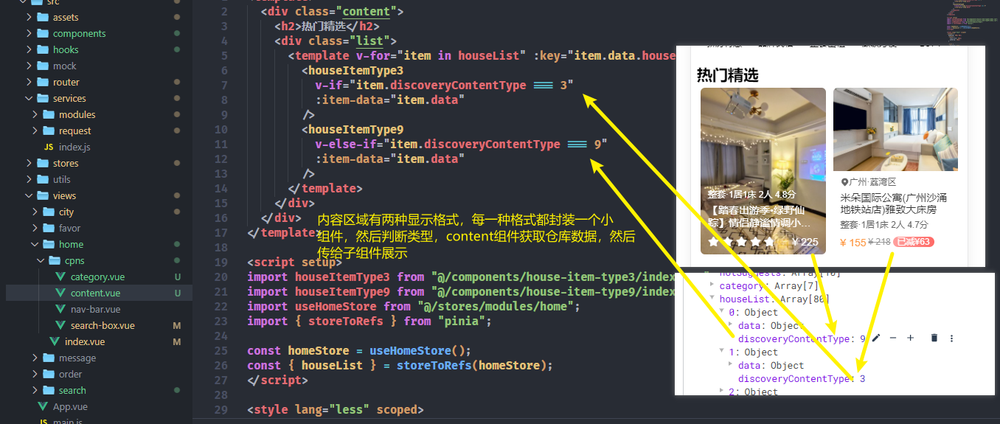
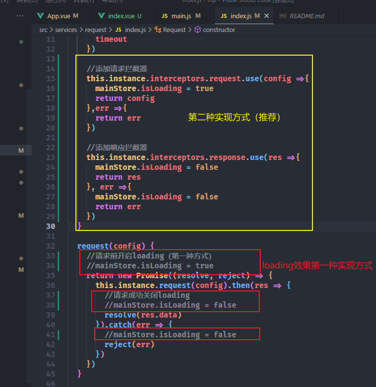
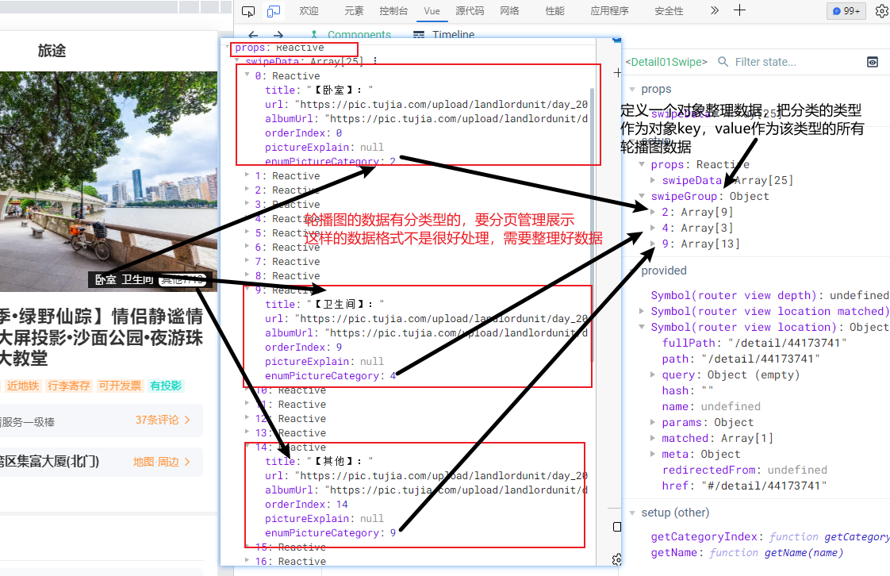
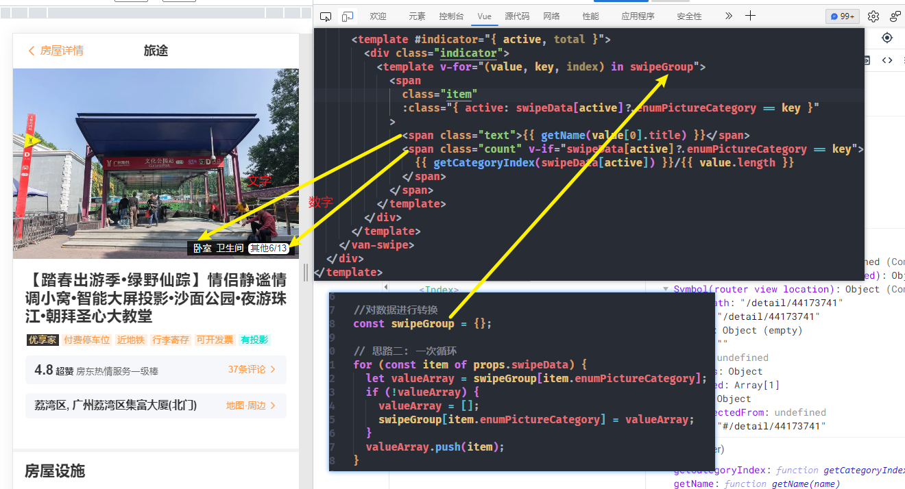
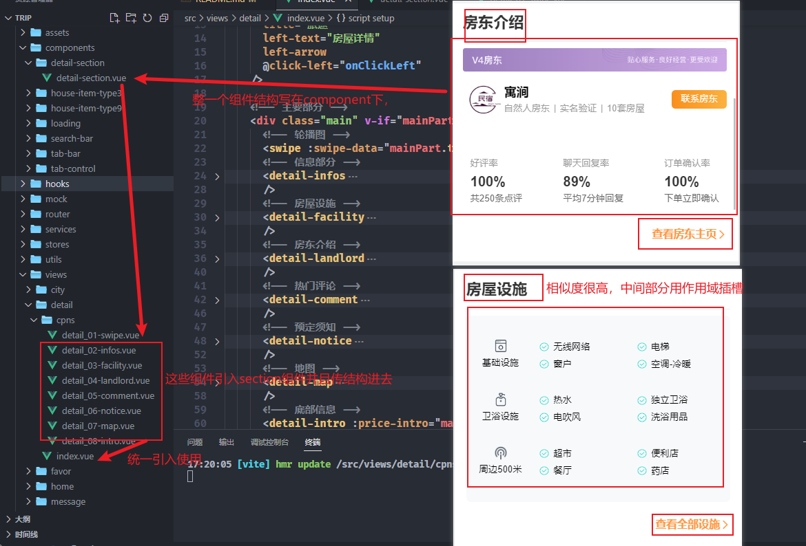
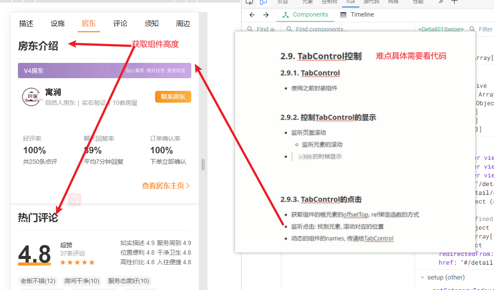
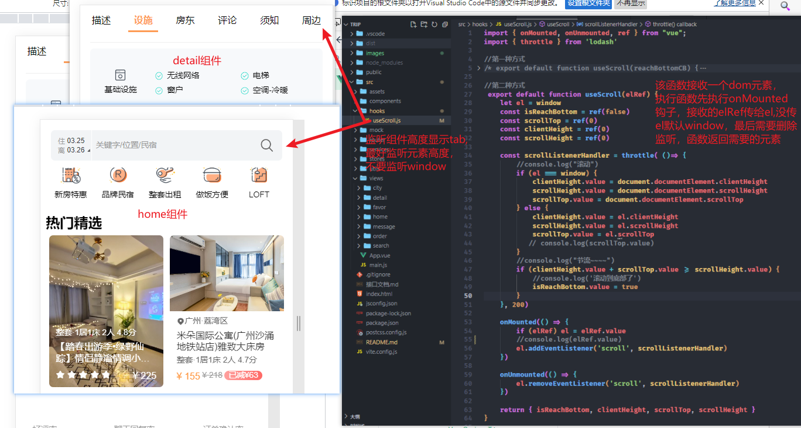

# trip 一些要点


## tabbar 搭建 
1. tabbar 1.0 是手搭建 ，2.0 是组件库搭建

2. 有些页面不显示 tabbar(两种做法)
   1. 利用路由 meta 控制，在 app 组件获取 route 信息判断即可
   2. 在不需要展示的页面下添加样式 (city 组件演示，该项目采用 meta)
      ```css
      .city {
        position: relative;
        z-index: 9;
        height: 100vh;
        overflow-y: auto;
        background: #fff;
      }
      ```

## content展示区域

home下的content展示区域



## 下拉加载loading效果
在service/request/index
在pinia中main模块中定义loading变量，供给个页面使用。main模块主要作用是共享全局的信息，比如token，日期，loading



## 轮播图分页管理




## 详细页面



## tabControl 难点


## 监听元素 （下拉到底，监听一定高度显示tab）
